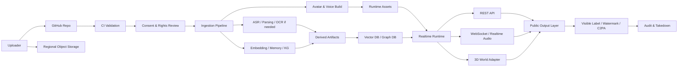
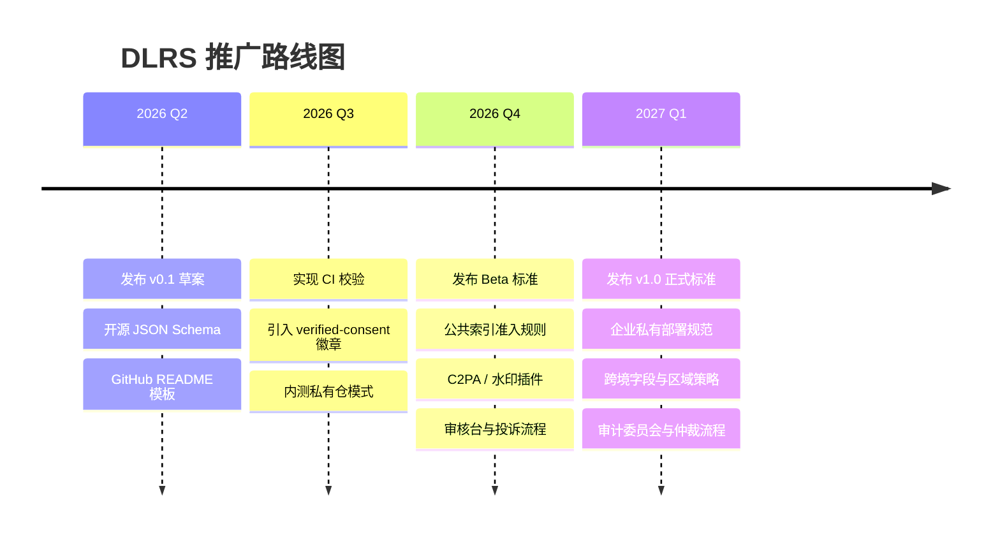

# 全球数字生命仓库行业标准草案

## 执行摘要

这份草案把“全球可上传数字生命仓库”定义为**一个以清晰授权、可验证 provenance、可撤回运行权、可审计派生链路为核心的标准化仓库**，而不是一个单纯收集音视频素材的 GitHub 项目。要支持高保真甚至“接近全保真”的多模态数字分身，仓库必须把四件事分开：**原始素材**、**派生素材**、**运行态模型/权重**、**公开输出**。如果这四层不分离，删除、继承、跨境、下架和事故止损都会在工程上变得不可执行。中国《个人信息保护法》要求对敏感个人信息取得单独同意，并赋予查阅、复制、转移、删除等权利；欧盟《AI Act》又要求生成式音视频等输出可被标识和披露其人工生成属性，因此“默认私有、公开需再授权、公开输出必须标识”应成为标准底线。citeturn11view2turn11view4turn11view5turn11view1

从现有公开技术资料看，**高保真会话分身已具备现实可行性，但“近似全保真”的多模态人格复制尚无统一公开行业门槛**。视频侧，Tavus 的官方 Replica 训练要求已经达到：最小 1080p、至少 25fps、连续单镜头、30 秒说话加 30 秒静止、眼平机位、脸占画面至少 25%、个人 Replica 需在视频中口述同意声明；全身版还建议 4K 和稳定直立采集。语音侧，ElevenLabs 的官方建议已将“最低可用”和“高质量可用”明显区分：即时克隆建议 1–2 分钟干净音频，专业克隆建议 30 分钟起步、2–3 小时更优，并在录音上强调 44.1/48kHz、24-bit、稳定音量与一致表演。换言之，今天能被产品化的是“可对话、可发声、可表情、可在 3D 场景中行动”的数字分身；不能被标准夸大的，是“完整复制真人全部判断、关系、伦理与临场应变”。citeturn15view5turn10view1turn16view0turn16view1turn16view2

因此，本草案提出一套**最小合格规范 MCS**：每个档案必须至少包含一个 `manifest.json`、一组可验证的同意/权利证据、原始素材清单、删除与导出策略、继承策略、区域与跨境字段、公开标识策略、审计与版本字段。对 GitHub 来说，仓库本身更适合保存**清单、Schema、README、轻量索引、派生摘要和校验结果**；体积大的原始音视频、3D 资产与模型权重不应直接堆入 Git 仓库，而应由 Git LFS、DVC、lakeFS 与外部对象存储协同承载。Git LFS 的设计本质就是用文本指针替代大文件，DVC 面向数据和实验版本控制，lakeFS 则把对象存储变为 Git-like 数据仓。citeturn1search3turn1search10turn1search1turn1search5

在运行态上，本草案建议采用“**仓库层 + 构建层 + 运行层 + 公开层**”四段式。仓库层接收上传与同意；构建层做转写、去噪、切片、记忆抽取、图谱构建与个性化微调；运行层负责文本、语音、视频和 3D avatar 的实时交互；公开层负责展示、标识、水印、内容凭证与撤回。对于实时语音与低延迟互动，可参考 OpenAI Realtime API 的 WebSocket 或 WebRTC 模式；对于知识检索与长期记忆，可使用向量库与知识图谱结合；对于权限，可将 ReBAC 交给 entity["organization","OpenFGA","auth project"] 模型，将 ABAC/策略约束交给 OPA 或 Cedar。citeturn10view2turn17view0turn17view1turn18search0turn18search8turn18search22turn18search2turn18search6turn18search11

成本上，真正的大头通常不是 GitHub，而是**对象存储、实时推理和人工审核**。按公开价格，S3 Standard 常见价格为前 50TB 每月约 \$0.023/GB，S3 Glacier Deep Archive 可低至约 \$0.00099/GB-month；OpenAI 转写官方标价约为 `gpt-4o-mini-transcribe` \$0.003/分钟、`gpt-4o-transcribe` \$0.006/分钟；Realtime 音频 token 成本则需按输入/输出音频 token 计费。把这些公开价格叠加后，单人档案的“存储成本”往往并不惊人，真正拉开差距的是**高保真视频、多角度 3D、长期在线会话和合规人工复核**。citeturn21search0turn20view3turn9search7turn7search2turn7search11

最后，这份标准草案的中心判断是：**行业标准不应承诺“复活一个人”，而应承诺“清楚地知道上传了什么、由谁授权、被如何构建、在哪些边界内运行、如何被删除与追责”。**这也是为什么本草案把“已验证同意”徽章、公开索引准入条件、机器可读标识、可撤回与可继承流程放在与模型质量同等重要的位置。欧盟《AI Act》已经明确要求对深度伪造内容进行披露，并要求提供者为合成内容加入机器可读标记；中国规则也要求对生成/深度合成内容添加标识并建立投诉举报机制。标准若不从第一天就把这些做成产品能力，后续补救成本会远高于一开始的工程成本。citeturn11view1turn3search0turn3search6turn3search7

## 标准目标与最低合格规范

这套标准建议把“全球可上传数字生命仓库”命名为 **Digital Life Repository Standard**，简称 **DLRS**。它的适用对象包括：个人自建数字分身、纪念/传承型档案、团队内部知识人格、研究型数字人格样本库，以及可被 3D 引擎调用的实时 avatar 代理。它**不适用于**未经权利验证的第三人克隆仓库，也不适用于未成年人开放公开库，更不应被当作身份认证、雇佣筛选、授信决策、医疗/法律建议主体。中国法下，生物识别和未满十四周岁未成年人信息都属于高敏感处理范畴；欧盟《AI Act》则对情绪识别、深伪披露和机器可读标记提出明确透明义务，因此“高拟真 ≠ 低门槛”应被写入标准的基本理念。citeturn11view2turn11view1turn4search1

建议的最小合格规范如下。表中的“必须”是库级硬门槛；“建议”是正式公开前应达到的工程门槛；“未知/未公开”表示公开资料没有形成统一行业定量值，因此本草案给的是建议值，而非法律强制值。

| 维度 | 最小合格规范 MCS | 公开依据或说明 |
|---|---|---|
| 权利主体 | 仅接受 `self`、`authorized_agent`、`estate_authorized`、`public_data_only` 四类上传身份 | 中国法要求明确处理者、接收方、处理目的与范围；向第三方提供需单独同意。citeturn11view3 |
| 同意证据 | 必须至少有 1 份可验证证据：同意视频、签名文件、平台内复核记录、委托书之一 | Tavus 明确要求 personal replica 在训练视频中包含口头同意声明。citeturn15view5 |
| 敏感信息 | 声纹、人脸、健康、生物识别、未成年人、关系图谱默认为敏感处理 | PIPL 将生物识别等列为敏感信息，并对 14 岁以下未成年人另设门槛。citeturn11view2 |
| 删除/导出 | 必须产品化支持删除、冻结、导出、转移、撤回同意 | PIPL 明确规定查阅、复制、转移和删除权。citeturn11view4turn11view5 |
| 公开显示 | 公开输出必须带显式标识；媒体文件建议同时带隐式水印/凭证 | 中国规则要求标识；EU AI Act 要求机器可读标记和深伪披露。citeturn3search0turn3search6turn11view1 |
| 跨境流动 | `cross_border_transfer_basis` 必填；原始素材默认区域内存储 | PIPL 第三十八条和出境标准合同办法要求出境前有法定路径与评估。citeturn11view2turn3search2 |
| 审计 | 上传、访问、构建、下架、删除、公开、投诉均需留痕 | EU AI Act 对高风险系统要求日志与可追溯性；中国规则要求投诉举报与记录。citeturn10view4turn3search0 |
| 3D 互操作 | avatar 运行态至少支持 glTF/VRM 之一；复杂影视级资产可加 OpenUSD | glTF 面向运行时分发，VRM 面向 humanoid avatar，OpenUSD 适合复杂制作管线。citeturn6search1turn6search5turn6search0 |
| 公开索引准入 | 仅接受“已验证同意”或“公开资料模式”条目进入公共 gallery | 属于本草案建议；公开法律豁免细节因法域不同而变化，[需律师审阅] |
| 继承与纪念化 | 必须声明 death / incapacity / no-response 三种触发后的默认动作 | PIPL 第四十九条允许近亲属就死者相关个人信息行使部分权利，死者生前另有安排的除外。citeturn11view5 |

如果要在社区快速推广，建议把 MCS 划为两层：**仓库准入标准**和**公开索引标准**。前者只要求“能合法收、能合法存、能合法删”；后者再增加“能合法公开、能被溯源、能被申诉、能被下架”。这能避免社区把“能上传”错误理解为“能公开”。同样重要的是，不应让“ high fidelity ”成为豁免合规的理由。恰恰相反，拟真度越高，披露、标识和访问控制应越严格。citeturn11view1turn3search0turn3search6

## 上传内容规范

公开资料已经给出了语音和视频侧较清晰的最低门槛，因此本草案先对齐这些门槛，再在文本、记忆、3D 和治理字段上补齐仓库标准。视频采集部分可直接参考 Tavus 的官方 Phoenix-4 Replica 规范：安静、光线均匀、简单背景、眼平机位、正脸、1080p 以上、25fps 以上、连续单镜头、30 秒说话加 30 秒静止、说话阶段牙齿清晰可见、仅一人入镜；个人 Replica 还要在视频中读出口头同意。语音采集部分可参考 ElevenLabs：即时克隆建议 1–2 分钟高质量清音频，专业克隆建议 30–180 分钟，录音建议 44.1/48kHz、24-bit、峰值约 -6 至 -3 dB、平均响度约 -18 dB，且尽量不使用降噪/EQ 等后处理。citeturn15view5turn16view0turn16view1turn16view2

### 上传目录结构建议

下面的目录结构适合直接落在 GitHub 仓库中；其中 `artifacts/` 建议只保存小尺寸样本、哈希、签名和指针文件，大体积原始文件应放到对象存储，并由清单引用。

```text
digital-life/
├─ README.md
├─ manifest.json
├─ consent/
│  ├─ consent_statement.md
│  ├─ consent_video.pointer.json
│  ├─ signer_signature.json
│  └─ id_verification.pointer.json
├─ profile/
│  ├─ subject_profile.json
│  ├─ values_and_preferences.json
│  ├─ relationship_policy.json
│  └─ inheritance_policy.json
├─ artifacts/
│  ├─ text/
│  │  ├─ corpus_index.jsonl
│  │  └─ docs.pointer.json
│  ├─ audio/
│  │  ├─ voice_master.pointer.json
│  │  ├─ voice_segments.csv
│  │  └─ asr_transcripts.jsonl
│  ├─ video/
│  │  ├─ talking_head_train.pointer.json
│  │  ├─ full_body_train.pointer.json
│  │  └─ keyframes/
│  ├─ image/
│  │  ├─ headshot_front.pointer.json
│  │  └─ headshot_variants/
│  └─ avatar/
│     ├─ avatar.vrm
│     ├─ scene.glb
│     ├─ rig.usda
│     └─ blendshape_map.json
├─ derived/
│  ├─ memory_atoms.jsonl
│  ├─ entity_graph.jsonl
│  ├─ embeddings.pointer.json
│  ├─ moderation_report.json
│  └─ c2pa_claims/
├─ runtime/
│  ├─ build_spec.json
│  ├─ adapters.pointer.json
│  ├─ prompts/
│  └─ session_policies.json
├─ audit/
│  ├─ access_log.pointer.json
│  ├─ takedown_log.jsonl
│  └─ provenance.json
└─ .github/
   └─ workflows/
      ├─ validate-manifest.yml
      └─ pii-policy-check.yml
```

### 上传内容类别与采集规范

下表中的“建议值”属于本草案的工程建议；“官方可确认值”来自公开文档。对“高保真/近全保真”部分，行业暂无统一公开量化门槛，故以“建议/未知或未公开”标注。

| 类别 | 文件/字段 | 最小可用集 | 高保真集 | 格式与采集规范 | 备注 |
|---|---|---|---|---|---|
| 主清单 | `manifest.json` | 1 份 | 每次变更 1 版 | UTF-8 JSON；必须含权利、区域、删除、版本、审计字段 | 仓库硬门槛 |
| 同意证据 | 同意视频、签名、证件核验、委托书 | 至少 1 项 | 视频 + 签名 + 平台核验链 | 同意视频建议单独上传并生成哈希；需记录时间戳和签署人 | PIPL/公开发布前强制项。citeturn15view5turn11view3 |
| 文本语料 | 聊天、文章、邮件、FAQ、简历、偏好 | 50–200 条代表性短对话 + 3–10 篇长文 | 10 万–500 万字，多时间段、多场景 | 推荐 JSONL/Markdown；每条必须带 `source`, `author`, `created_at`, `consent_scope` | 行为与价值观主要靠这里抽取 |
| 语音样本 | `voice_master.*` | 1–2 分钟干净语音 | 30–180 分钟；多情绪但录音链统一 | 推荐 MP3 192kbps+ 或 WAV；更建议 44.1/48kHz、24-bit；平均响度约 -18 dB，true peak 约 -3 dB；避免混响、多人、底噪、噪声抑制 | ElevenLabs 官方建议。citeturn16view0turn16view1turn16view2 |
| talking head 训练视频 | `talking_head_train.*` | 60 秒连续视频 | 5–30 分钟多情绪多文本，但机位一致 | 最低 1080p、25fps、单镜头、安静、简单背景、眼平机位、正脸、脸占画面 ≥25%、30 秒说话 + 30 秒静止、只允许 1 人 | Tavus 公开可确认规范。citeturn15view5 |
| 全身/动作视频 | `full_body_train.*` | 可选 | 10–60 分钟站立、步态、转身、手势集 | 竖屏或等效纵向裁切；推荐 4K；光照稳定；避免夸张动作 | Tavus 对 full body 建议 4K；其余细节多为本草案建议。citeturn15view5 |
| 头像图片 | `headshot_front.*` | 1 张正脸高清图 | 12–60 张多角度高质量图 | JPG/PNG；最低 512×512；头肩清晰；不遮挡脸和颈部 | Tavus 图片训练最低门槛。citeturn15view5 |
| 3D avatar | `avatar.vrm` / `scene.glb` / `rig.usda` | VRM 或 glTF 其一 | VRM + glTF + OpenUSD 全套 | humanoid avatar 推荐 VRM；运行时资产推荐 glTF；复杂制作管线可加 OpenUSD | VRM/glTF/OpenUSD 各司其职。citeturn6search0turn6search1turn6search5 |
| blendshape / 情绪 | `blendshape_map.json` | `neutral/happy/sad/angry/surprised` 五类 | 再加 `fear/disgust/empathy/thinking/confused` 等 | 建议把情绪做成离散标签 + 强度区间 0–1，而不是只写自然语言 | 行业统一标签集未知/未公开 |
| 关系/记忆 | `memory_atoms.jsonl`、`entity_graph.jsonl` | 100–300 条 memory atoms | 1,000–10,000 条带来源和删除标记 | 每条必须带 `source_uri`, `confidence`, `sensitivity`, `erasable`, `expires_at` | 关系数据优先最小化采集 |
| 审计日志 | `provenance.json`, `takedown_log.jsonl` | 初始创建 + 变更历史 | 全链路事件流 | append-only；建议同时写入不可篡改账本 | 公开索引前必须具备 |

### 建议文件命名规则

| 类别 | 命名规则示例 |
|---|---|
| 同意视频 | `consent_2026-04-25T103000+0800_self.mp4` |
| 主训练语音 | `voice_master_zh-CN_48k24b_take01.wav` |
| 即时克隆样本 | `voice_ivc_sample_neutral_001.mp3` |
| 正脸头像 | `headshot_front_20260425_01.png` |
| talking head 视频 | `talking_head_train_1080p25_take03.mp4` |
| 全身训练视频 | `full_body_train_4k30_take02.mp4` |
| VRM 模型 | `avatar_vrm1.0_main.vrm` |
| 场景 glTF | `avatar_runtime_scene_v2.glb` |
| OpenUSD rig | `avatar_rig_v3.usda` |
| 记忆原子集 | `memory_atoms_2026-04-25.jsonl` |

### 建议的 JSON Schema

下面给出一个可直接复用的、面向仓库准入的 `manifest.json` Schema 草案。它不覆盖所有运行期细节，但足以作为 GitHub 仓库校验入口。

```json
{
  "$schema": "https://json-schema.org/draft/2020-12/schema",
  "$id": "https://example.org/dlrs/manifest.schema.json",
  "title": "DLRS Manifest",
  "type": "object",
  "required": [
    "schema_version",
    "record_id",
    "visibility",
    "subject",
    "rights",
    "consent",
    "artifacts",
    "deletion_policy",
    "security",
    "review",
    "audit"
  ],
  "properties": {
    "schema_version": { "type": "string", "pattern": "^1\\.0\\.\\d+$" },
    "record_id": { "type": "string", "minLength": 8 },
    "visibility": { "type": "string", "enum": ["private", "team", "public_indexed", "public_unlisted"] },
    "subject": {
      "type": "object",
      "required": ["type", "display_name", "locale", "residency_region", "is_minor"],
      "properties": {
        "type": { "type": "string", "enum": ["self", "authorized", "estate_authorized", "public_data_only"] },
        "display_name": { "type": "string" },
        "legal_name": { "type": ["string", "null"] },
        "locale": { "type": "string" },
        "residency_region": { "type": "string" },
        "is_minor": { "type": "boolean" }
      }
    },
    "rights": {
      "type": "object",
      "required": [
        "uploader_role",
        "rights_basis",
        "allow_public_listing",
        "allow_model_finetune",
        "allow_voice_clone",
        "cross_border_transfer_basis"
      ],
      "properties": {
        "uploader_role": { "type": "string" },
        "rights_basis": { "type": "array", "items": { "type": "string" } },
        "evidence_refs": { "type": "array", "items": { "type": "string" } },
        "allow_public_listing": { "type": "boolean" },
        "allow_commercial_use": { "type": "boolean" },
        "allow_model_finetune": { "type": "boolean" },
        "allow_voice_clone": { "type": "boolean" },
        "allow_avatar_clone": { "type": "boolean" },
        "cross_border_transfer_basis": {
          "type": "string",
          "enum": ["none", "consent_only", "standard_contract", "certification", "security_assessment", "other_lawful_basis"]
        }
      }
    },
    "consent": {
      "type": "object",
      "required": ["captured_at", "withdrawal_endpoint"],
      "properties": {
        "captured_at": { "type": "string", "format": "date-time" },
        "separate_biometric_consent": { "type": "boolean" },
        "guardian_consent": { "type": "boolean" },
        "withdrawal_endpoint": { "type": "string" }
      }
    },
    "artifacts": {
      "type": "array",
      "minItems": 1,
      "items": {
        "type": "object",
        "required": ["artifact_id", "type", "format", "storage_uri", "checksum", "region"],
        "properties": {
          "artifact_id": { "type": "string" },
          "type": {
            "type": "string",
            "enum": [
              "text_corpus",
              "voice_sample",
              "training_video_head",
              "training_video_full_body",
              "headshot",
              "avatar_vrm",
              "avatar_gltf",
              "avatar_openusd",
              "memory_atoms",
              "knowledge_graph",
              "embedding_index",
              "audit_log"
            ]
          },
          "format": { "type": "string" },
          "storage_uri": { "type": "string" },
          "checksum": { "type": "string" },
          "region": { "type": "string" },
          "contains_sensitive_data": { "type": "boolean" }
        }
      }
    },
    "deletion_policy": {
      "type": "object",
      "required": ["allow_delete", "allow_export", "withdrawal_effect"],
      "properties": {
        "allow_delete": { "type": "boolean" },
        "allow_export": { "type": "boolean" },
        "withdrawal_effect": {
          "type": "string",
          "enum": ["freeze_runtime_then_delete", "freeze_runtime_keep_archive", "delete_all_nonlegal_holds"]
        }
      }
    },
    "security": {
      "type": "object",
      "required": ["primary_region", "encryption_at_rest", "kms_ref"],
      "properties": {
        "primary_region": { "type": "string" },
        "encryption_at_rest": { "type": "boolean" },
        "kms_ref": { "type": "string" },
        "watermark_policy": { "type": "string" },
        "c2pa_enabled": { "type": "boolean" }
      }
    },
    "review": {
      "type": "object",
      "required": ["status"],
      "properties": {
        "status": { "type": "string", "enum": ["draft", "submitted", "blocked", "approved_private", "approved_public"] },
        "verified_consent_badge": { "type": "boolean" }
      }
    },
    "audit": {
      "type": "object",
      "required": ["created_at", "last_modified_at"],
      "properties": {
        "created_at": { "type": "string", "format": "date-time" },
        "last_modified_at": { "type": "string", "format": "date-time" },
        "change_log_hash": { "type": "string" }
      }
    }
  }
}
```

### 示例 JSON

```json
{
  "schema_version": "1.0.0",
  "record_id": "dlrs_94f1c9b8",
  "visibility": "private",
  "subject": {
    "type": "self",
    "display_name": "Lin",
    "legal_name": "Lin Example",
    "locale": "zh-CN",
    "residency_region": "CN",
    "is_minor": false
  },
  "rights": {
    "uploader_role": "self",
    "rights_basis": ["consent"],
    "evidence_refs": [
      "obj://cn-shanghai/consent/consent_2026-04-25T103000+0800_self.mp4",
      "obj://cn-shanghai/consent/signer_signature.json"
    ],
    "allow_public_listing": false,
    "allow_commercial_use": false,
    "allow_model_finetune": true,
    "allow_voice_clone": true,
    "allow_avatar_clone": true,
    "cross_border_transfer_basis": "none"
  },
  "consent": {
    "captured_at": "2026-04-25T10:30:00+08:00",
    "separate_biometric_consent": true,
    "guardian_consent": false,
    "withdrawal_endpoint": "mailto:privacy@example.org"
  },
  "artifacts": [
    {
      "artifact_id": "a001",
      "type": "voice_sample",
      "format": "wav",
      "storage_uri": "obj://cn-shanghai/audio/voice_master_zh-CN_48k24b_take01.wav",
      "checksum": "sha256:abcd1234",
      "region": "CN",
      "contains_sensitive_data": true
    },
    {
      "artifact_id": "a002",
      "type": "training_video_head",
      "format": "mp4",
      "storage_uri": "obj://cn-shanghai/video/talking_head_train_1080p25_take03.mp4",
      "checksum": "sha256:efgh5678",
      "region": "CN",
      "contains_sensitive_data": true
    },
    {
      "artifact_id": "a003",
      "type": "avatar_vrm",
      "format": "vrm",
      "storage_uri": "obj://cn-shanghai/avatar/avatar_vrm1.0_main.vrm",
      "checksum": "sha256:vrm12345",
      "region": "CN",
      "contains_sensitive_data": false
    }
  ],
  "deletion_policy": {
    "allow_delete": true,
    "allow_export": true,
    "withdrawal_effect": "freeze_runtime_then_delete"
  },
  "security": {
    "primary_region": "CN",
    "encryption_at_rest": true,
    "kms_ref": "kms://cn-shanghai/key-001",
    "watermark_policy": "visible_and_invisible",
    "c2pa_enabled": true
  },
  "review": {
    "status": "submitted",
    "verified_consent_badge": false
  },
  "audit": {
    "created_at": "2026-04-25T10:45:00+08:00",
    "last_modified_at": "2026-04-25T10:45:00+08:00",
    "change_log_hash": "sha256:manifestlog001"
  }
}
```

### 可直接复制的 README 模板

```markdown
# [显示名称] Digital Life Archive

## 状态
- 可见性：private / team / public_indexed / public_unlisted
- 审核状态：draft / submitted / approved_private / approved_public
- 已验证同意徽章：true / false

## 档案摘要
- 主体类型：self / authorized / estate_authorized / public_data_only
- 主要语言：zh-CN
- 主要地区：CN
- 目标用途：personal_assistant / memorial / research / avatar_runtime
- 禁止用途：identity_verification / political_persuasion / employment_screening / credit_scoring / medical_advice / legal_advice / impersonation

## 权利与同意
- 权利基础：consent / contract / estate_authorization / public_data_only
- 是否允许公开索引：false
- 是否允许商业化：false
- 是否允许语音克隆：true
- 是否允许 avatar 克隆：true
- 是否允许模型微调：true
- 是否允许跨境处理：false
- 撤回入口：privacy@example.org

## 文件清单
请见 `manifest.json`

## 数据规范
- 所有时间统一使用 ISO 8601
- 所有媒体文件必须记录 SHA-256
- 所有敏感文件必须记录 `contains_sensitive_data=true`
- 原始文件请使用对象存储 URI，不要直接将大文件提交到 Git

## 公开披露
如本档案产生公开音频、视频、图像或文本，输出必须带显式标识；媒体文件应启用隐式水印或 C2PA 元数据。

## 免责声明
本仓库中的任何输出均为合成内容，不代表真人主体的真实、即时、完整或最终意思表示。
```

### 自动化校验脚本思路

建议在 GitHub Actions 中至少运行四类校验：**Schema 校验、文件命名校验、媒体元数据校验、合规字段校验**。大文件不直接入 Git，由 `.pointer.json` 存储对象 URI、哈希和区域。这样既能兼容 GitHub，又能把原始高敏感文件放在区域化对象存储中。GitHub 官方文档支持对超限大文件使用 Git LFS；而 DVC 和 lakeFS 更适合再向外扩展到模型与数据版本。citeturn1search15turn1search3turn1search10turn1search1

```bash
#!/usr/bin/env bash
set -euo pipefail

# 1) manifest schema 校验
ajv validate -s schemas/manifest.schema.json -d manifest.json

# 2) 命名规则与必要文件
test -f README.md
test -f manifest.json
test -d consent
test -d audit

# 3) 校验 pointer 文件字段
jq -e '.storage_uri and .checksum and .region' consent/consent_video.pointer.json >/dev/null

# 4) 可选：用 ffprobe 校验媒体元数据
ffprobe -v error -select_streams v:0 -show_entries stream=width,height,r_frame_rate \
  -of json artifacts/video/*.mp4 > /tmp/video_meta.json

# 5) 合规关键字段
jq -e '.rights.cross_border_transfer_basis' manifest.json >/dev/null
jq -e '.deletion_policy.allow_delete == true' manifest.json >/dev/null
jq -e '.consent.withdrawal_endpoint' manifest.json >/dev/null

echo "DLRS validation passed."
```

如果用 Python，更适合把“最低 1080p、至少 25fps、含同意证据、禁止 public 但无 badge 时公开”等规则写成可维护策略；一旦违反，PR 直接打回。视频和音频推荐通过 `ffprobe` 自动抽取 `codec_name`, `sample_rate`, `channels`, `duration`, `bit_rate`, `avg_frame_rate` 等元数据写回审计报告。Tavus 和 ElevenLabs 的公开文档都说明了采集质量比“格式本身”更重要，因此**自动校验只能筛掉不合格输入，不能替代人工质检**。citeturn15view5turn16view0turn16view2

## 数据分层与存储策略

GitHub 仓库只适合承担“**清单层**”。真正的全球数字生命仓库应至少拆成五层：**Raw 原始素材**、**Derived 派生素材**、**Runtime 运行态模型/权重**、**Index/Vector 索引层**、**Audit 审计层**。其中 Raw 是法律风险最高的数据，必须与公开层隔离；Derived 是最容易被误判为“匿名数据”的层，但 embedding、声纹向量、面部特征和关系图谱在很多法域都不应被视为天然匿名；Runtime 是最需要管控复制、下载和二次训练的层；Audit 则需要做到 append-only 或不可篡改。lakeFS 适合把对象存储变成可分支、可回滚的数据仓；DVC 适合把数据、模型、实验和流水线纳入版本；Git LFS 适合 Git 仓里只留大文件指针。citeturn1search1turn1search5turn1search10turn1search3

### 推荐分层

| 层级 | 内容 | 存储建议 | 版本策略 | 公开策略 |
|---|---|---|---|---|
| Raw | 原始文本、音频、视频、图片、身份证明、同意视频 | 区域对象存储；默认私有 | lakeFS/DVC 指针化 | 一律不公开 |
| Derived | 转写、切片、embedding、memory atoms、KG、关键帧、特征向量 | 区域对象存储 + 数据库 | DVC + schema 版本 | 默认不公开，仅摘要可公开 |
| Runtime | LoRA/Adapter、prompt profile、TTS voice profile、avatar config | 专用模型仓/对象存储 | 模型版本号 + hash | 默认不下载 |
| Index | 向量索引、图谱索引、检索缓存 | 向量库 / 图库 / KV | rebuild version + embedding model version | 不公开 |
| Audit | 访问日志、删除工单、投诉、构建历史、C2PA claim | 不可篡改账本 + 冷存档 | append-only | 仅授权审计 |

### 区域化与跨境字段

中国法下，个人信息出境通常需要满足法定路径之一，包括安全评估、认证或标准合同；同时，向其他处理者提供个人信息也要求告知接收方、联系方式、处理目的和种类并取得单独同意。PIPL 还要求对敏感个人信息说明必要性与影响。对全球仓库而言，这意味着 **`cross_border_transfer_basis`、`recipient_region`、`recipient_controller`、`legal_hold`、`sensitivity_level`、`lawful_basis_notes`** 都应成为清单的强制字段。citeturn11view2turn11view3turn3search2

建议强制增加以下字段：

| 字段 | 含义 |
|---|---|
| `primary_region` | 原始素材主存储区域 |
| `replication_regions` | 是否有异地副本 |
| `cross_border_transfer_basis` | `none/consent_only/standard_contract/certification/security_assessment/other` |
| `cross_border_transfer_status` | `not_needed/pending/approved/blocked` |
| `data_subject_jurisdiction` | 主体所在法域 |
| `processor_jurisdiction` | 仓库或运行服务托管法域 |
| `legal_hold` | 是否因争议/合规留存而暂停删除 |
| `restrict_public_runtime` | 即使保留存档，也冻结公开运行态 |
| `export_format_available` | 是否支持标准导出包 |

### 单人档案存储与算力估算

下面的三档是**工程估算**，不是法律门槛。它们以“文本档案、音视频素材、3D 资产和索引”为主要部分，结合公开存储价格给出月度量级。由于 S3 Standard 前 50TB 常见价格约 \$0.023/GB-month，而 Glacier Deep Archive 可低至约 \$0.00099/GB-month，所以长期成本通常可以通过冷热分层显著下降。citeturn21search0turn20view3

| 档位 | 典型内容 | 单人总量估算 | 热存月成本估算 | 冷存月成本估算 | 构建/运行算力建议 |
|---|---|---:|---:|---:|---|
| 低保真 | 文本 + 1–2 分钟语音 + 1 段 60 秒 talking head + 基础头像 | 1–3 GB | \$0.02–\$0.07 | \$0.001–\$0.003 | 转写与 RAG 基本可 CPU + 小型 GPU；实时语音可托管 API |
| 中保真 | 文本 + 30–90 分钟语音 + 10–30 分钟视频 + VRM/glTF avatar + 向量索引 | 8–30 GB | \$0.18–\$0.69 | \$0.008–\$0.03 | 需要 1 张中高端 GPU 进行 ASR/TTS/avatar 构建与推理 |
| 高保真 | 长时文本与关系图谱 + 2–3 小时专业录音 + 多段视频/全身动作 + 影视级 3D 资产 + 多索引 | 50–250 GB | \$1.15–\$5.75 | \$0.05–\$0.25 | 需要多模块 GPU 管线；若长期在线，需至少 1–4 张生产 GPU 或托管视频/语音服务 |

如果采用托管转写，公开价格可直接估算：`gpt-4o-mini-transcribe` 约 \$0.003/分钟，`gpt-4o-transcribe` 约 \$0.006/分钟。于是 30 分钟音频转写约 \$0.09–\$0.18，3 小时音频约 \$0.54–\$1.08。若采用实时音频会话，按 OpenAI Realtime 的音频 token 计价规则，用户输入音频约 1 token/100ms、模型输出音频约 1 token/50ms；结合 `gpt-realtime-mini` 的音频输入 \$10/百万 token、输出 \$20/百万 token，单纯音频 token 成本大致约 \$0.03/分钟；`gpt-realtime-1.5` 则大致约 \$0.096/分钟，未计文本、工具调用和外部检索。citeturn9search7turn7search11turn7search2

### 云托管与自托管比较

| 维度 | 云托管 | 自托管 |
|---|---|---|
| 初始上线速度 | 快，厂商 API 可直接集成 | 慢，需要完整基础设施 |
| 数据主权 | 取决于供应商区域与合同 | 最强，可按法域部署 |
| GPU 成本结构 | 按量费；预算可控但长期可能更贵 | 前期 CAPEX 或长期资源承诺更重 |
| 合规证明 | 便于复用厂商合规材料，但需补齐自身流程 | 证明链更完整，但也要自己承担全部控制责任 |
| 性能调优 | 受供应商限制 | 自由度高 |
| 删除与隔离 | 依赖供应商能力和合同 | 粒度可控，但工程难度高 |
| 适合阶段 | MVP、Beta、跨区域试点 | 企业版、法域敏感版、长期运行版 |
| 主要风险 | 供应商锁定、跨境合规、黑盒运维 | 运维复杂、安全能力不足、故障恢复成本高 |

如果必须处理高敏感语料，建议在对象存储之外引入机密计算/TEE 与不可篡改审计：例如在 entity["company","Amazon Web Services","cloud provider"] 可参考 Nitro Enclaves 的隔离计算与 attest 机制，而账本侧可参考云上的保密账本服务或自建 append-only log。其意义不是代替访问控制，而是在“数据正在被使用”这一阶段增加保护层。citeturn14search2turn14search14turn14search1turn14search9

## 技术栈与运行时接口

在系统实现上，我建议把“上传—处理—构建—运行—公开”做成清晰分层，而不是把所有能力直接塞进一个应用。文本、语音、视频和 3D avatar 的公开生态已经很丰富，但真正能支撑全球仓库和社区标准的，不是单一模型，而是**模块之间的边界清晰、事件可追、审计可验、权限可收回**。文本推理可选托管大模型或自托管 LLM；自托管时可用 vLLM 作为高吞吐、内存友好的推理引擎，个性化微调可用 QLoRA/LoRA；知识检索层可用向量数据库和图谱混合；实时交互层可用 REST + WebSocket + 实时语音流；输出层必须叠加标签、水印和 provenance。citeturn1search20turn9search0turn5search0turn17view0turn17view2



### 模块选型比较

| 模块 | 开源/商用候选 | 优点 | 缺点 | 成熟度 | 算力与风险 |
|---|---|---|---|---|---|
| 文本核心 | 托管 LLM / 自托管 LLM + vLLM | 托管快；自托管数据控制更强 | 托管有跨境与供应商依赖；自托管运维重 | 高 | vLLM 主打高吞吐和内存效率。citeturn1search20 |
| ASR | Whisper、FunASR、托管转写 | Whisper 公开、泛化强；托管上手快 | 专有名词、多人分离仍需后处理 | 高 | Whisper 论文基于 68 万小时弱监督训练。citeturn0search3 |
| TTS/语音克隆 | OpenVoice、CosyVoice、ElevenLabs | OpenVoice 零样本短参考；CosyVoice 多语；商用品质高 | 滥用风险高；高保真需要高质量录音 | 高 | OpenVoice 支持短音频克隆；CosyVoice 强多语。citeturn5search1turn5search5turn5search2 |
| 视频/头像 | SadTalker、Tavus 等 Replica 服务 | 开源适合 demo；商用适合更稳的产品级头像 | 公开深伪风险极高；高保真训练条件苛刻 | 中高 | Tavus 要求明确采集规范；SadTalker 可离线运行。citeturn15view5turn5search3turn5search7 |
| 3D avatar | VRM、glTF、OpenUSD、NVIDIA Audio2Face | VRM 适合 humanoid；glTF 适合 runtime；OpenUSD 适合复杂制作；Audio2Face 适合音频驱动表情 | 互操作复杂；需要 rig/blendshape 规范 | 中高 | Audio2Face 本地执行约需 2.9–4.4 GiB VRAM 或以上。citeturn6search0turn6search1turn6search11turn7search1 |
| 长期记忆 | 向量库 + 记忆原子 | 实现快、检索直接 | 事实冲突和时间关系较弱 | 高 | 向量库适合原型和生产检索。citeturn2search0turn17view2 |
| 知识图谱 | GraphRAG + 图数据库 | 更适合人物、事件、关系、时序一致性 | 构图与治理复杂 | 中高 | GraphRAG 明确面向 narrative private data。citeturn5search0turn5search12 |
| 个性化微调 | LoRA / QLoRA | 成本远低于全参微调 | 删除和回滚比 profile/RAG 更难 | 高 | QLoRA 宣称可在单张 48GB GPU 上微调 65B 模型。citeturn9search0 |
| 隐私增强 | 差分隐私、联邦学习、TEE | 降低集中化隐私暴露 | 实现复杂，性能与质量折损 | 中 | FL 不等于默认安全；DP 需量化隐私预算。citeturn9search1turn9search2turn14search2 |
| 标识/水印 | entity["organization","C2PA","content provenance group"]、AudioSeal、Meta Seal、厂商内部追溯 | 可组合显式标识、隐式水印和 provenance | 单一机制都不是万能 | 中高 | C2PA 适合 provenance；entity["company","Meta","technology company"] AudioSeal 面向音频水印；厂商分类器常有覆盖边界。citeturn19search1turn19search3turn19search19turn19search11 |
| 合成检测 | 厂商分类器 + 内部日志 + 反向检索 | 成本低，能应急 | 误报漏报不可避免 | 中 | ElevenLabs 的分类器只检自己部分模型，且对部分新模型并不可靠。citeturn19search0 |

对于检索和图谱层，建议优先把向量搜索和关系推理分开。entity["company","Qdrant","vector database company"] 官方文档说明其支持 REST、OpenAPI 和 gRPC，并支持实时更新后立即检索；而 entity["company","Neo4j","graph database company"] 的知识图谱范式更适合角色关系和事件时间线。GraphRAG 可作为把私有 narrative 文本转化为可问答图谱的中间层。citeturn17view2turn2search15turn2search1turn5search0

### 权限模型与事件模型

标准建议把权限设计成 **RBAC + ReBAC + ABAC** 组合，而不是只用角色。角色适合后台审核台；关系适合“本人/家庭成员/受托代理/研究伙伴/公共访问者/投诉处理人”这种对象相关权限；属性适合法域、敏感级别、是否已验证同意、是否处于 legal hold、是否属于未成年人/逝者等条件。entity["organization","OpenFGA","auth project"] 适合 ReBAC；OPA 和 Cedar 适合把法域、风险分级和上下文条件外置成策略代码。citeturn18search0turn18search8turn18search22turn18search2turn18search6turn18search11

建议定义以下核心事件：

| 事件名 | 触发时机 | 必填审计字段 |
|---|---|---|
| `record_created` | 新建档案 | `record_id`, `actor_id`, `jurisdiction`, `ip_hash`, `timestamp` |
| `consent_verified` | 审核通过同意证据 | `evidence_hash`, `reviewer_id`, `verification_method` |
| `build_started` | 开始构建数字分身 | `build_id`, `input_artifact_ids`, `model_profile` |
| `public_listing_requested` | 申请公开索引 | `record_id`, `requested_scope`, `badge_target` |
| `consent_withdrawn` | 主体撤回同意 | `record_id`, `withdrawal_mode`, `runtime_freeze=true` |
| `take_down` | 平台或投诉触发下架 | `reason_code`, `complaint_id`, `visibility_before/after` |
| `inheritance_trigger` | 死亡/长期失联/法定触发 | `evidence_ref`, `executor_id`, `policy_path` |
| `export_requested` | 导出档案包 | `format`, `destination_controller`, `approval_state` |

### OpenAPI 片段示例

下面的片段是**标准建议**，不是厂商现成 API。它适合做仓库层与运行层的公共接口。

```yaml
openapi: 3.1.0
info:
  title: Digital Life Repository API
  version: 1.0.0
paths:
  /records:
    post:
      summary: 创建数字生命档案
      requestBody:
        required: true
        content:
          application/json:
            schema:
              $ref: '#/components/schemas/RecordCreate'
      responses:
        '201':
          description: Created
  /records/{recordId}/artifacts:
    post:
      summary: 注册素材指针或上传会话
      parameters:
        - in: path
          name: recordId
          required: true
          schema: { type: string }
      responses:
        '202':
          description: Accepted
  /records/{recordId}/builds:
    post:
      summary: 触发构建
      responses:
        '202':
          description: Build started
  /records/{recordId}/visibility:
    patch:
      summary: 切换可见性
      responses:
        '200':
          description: Updated
  /records/{recordId}/withdraw:
    post:
      summary: 撤回同意并冻结运行态
      responses:
        '202':
          description: Withdrawal accepted
components:
  schemas:
    RecordCreate:
      type: object
      required: [display_name, subject_type, primary_region]
      properties:
        display_name: { type: string }
        subject_type: { type: string, enum: [self, authorized, estate_authorized, public_data_only] }
        primary_region: { type: string }
        allow_public_listing: { type: boolean }
        cross_border_transfer_basis: { type: string }
```

### WebSocket 消息示例

公开资料表明，OpenAI Realtime API 的 WebSocket 会以 JSON 事件形式双向收发消息；Qdrant 则明确提供 REST/OpenAPI 与 gRPC。基于这个事实，数字生命仓库可把控制事件与实时语音事件分开：仓库控制走 REST，实时对话走 WebSocket。citeturn17view0turn17view1turn17view2

```json
{
  "type": "session.update",
  "session": {
    "session_id": "sess_123",
    "record_id": "dlrs_94f1c9b8",
    "modalities": ["text", "audio", "avatar"],
    "voice_profile": "voice_profile_main",
    "avatar_profile": "avatar_runtime_v2",
    "policy_scope": "private_runtime"
  }
}
```

```json
{
  "type": "event.notification",
  "event_name": "consent_withdrawn",
  "record_id": "dlrs_94f1c9b8",
  "effective_action": "freeze_runtime_then_delete",
  "timestamp": "2026-04-25T12:01:30Z"
}
```

## 合规同意与免责声明

合规设计必须从“谁可以上传、凭什么上传、谁可以继续运行”三个层次写起。中国法下，向其他处理者提供个人信息需要单独同意；敏感个人信息也须单独同意；未满十四周岁未成年人的个人信息处理需监护人同意并制定专门规则；个人有权查阅、复制、转移和删除；自然人死亡后，近亲属为自身合法正当利益可对死者相关个人信息行使查阅、复制、更正、删除等权利，但死者生前另有安排的除外。对全球仓库而言，这几条已经足以说明：**同意、删除、继承和公开权限必须是数据结构里的显式字段，而不是 FAQ 文字。**citeturn11view2turn11view3turn11view4turn11view5

在欧盟/EEA 场景中，这类项目往往会触及特殊类别数据、深伪披露和高风险处理评估。公开可见的官方与官方衍生资料表明，GDPR 第 9 条对特殊类别数据处理原则上采取严格限制，Article 17/20 涉及删除与可携带，Article 35 要求高风险处理开展 DPIA；EU AI Act 则要求生成式系统输出可被机器可读标记，深伪音视频须向受众清楚披露其人工生成或操纵属性。由于各成员国对遗产、人格利益、肖像与死后保护还有本地规则差异，相关实现应标记为 **[需律师审阅]**。citeturn22search4turn22search5turn22search6turn13search1turn11view1

### 标准化同意书字段

| 字段 | 是否必填 | 说明 |
|---|---|---|
| 主体身份 | 是 | 本人/代理/遗产执行人/公开资料模式 |
| 被复刻主体信息 | 是 | 显示名、实名、地区、是否未成年人 |
| 权利基础 | 是 | 同意、合同、授权、遗产授权、公开资料等 |
| 同意范围 | 是 | 存储、构建、语音克隆、avatar、公开索引、商业化、跨境 |
| 生物识别单独同意 | 建议必填 | 声纹、人脸、步态等分开勾选 |
| 删除与撤回规则 | 是 | 删除时限、冻结运行态、保留范围 |
| 继承与纪念化选项 | 建议必填 | 删除、冻结、纪念模式、交由遗产执行人 |
| 合成披露规则 | 是 | 对外公开是否必须显示 AI 标识 |
| 证据链 | 是 | 同意视频、签名、证件核验、委托书 |
| 争议处理 | 是 | 投诉邮箱、下架入口、适用法/争议解决方式 [需律师审阅] |

### 证据要求建议

| 场景 | 最低证据 | 公开前附加证据 |
|---|---|---|
| 本人上传 | 同意视频或签名文件二选一 | 同意视频 + 账户强校验更优 |
| 代理上传 | 委托书 + 主体同意 | 代理关系核验 + 主体验证 |
| 逝者档案 | 死者生前安排或近亲属/执行人证明 | 关系证明 + 争议期冻结机制 [需律师审阅] |
| 未成年人 | 监护人同意 + 年龄校验 | 原则上不允许进入公开索引 [需律师审阅] |
| 公开资料模式 | 仅限“公开资料摘要人格”，不得上传疑似私密原件 | 不得开放高拟真语音/视频克隆 [需律师审阅] |

### 可直接使用的中文同意书草案

以下文本适合做产品内同意书模板。涉及适用法、争议解决、未成年人和逝者权益的部分应由目标法域律师复核。

**数字生命档案上传与构建同意书（草案）**

本人/本机构确认，就本次上传的“数字生命”档案、素材及衍生信息，已经充分知晓平台将对相关内容进行存储、校验、结构化处理、向量化索引、知识图谱构建、语音/视频/三维角色生成、模型适配及受限运行等处理活动。本人/本机构确认，已理解相关处理可能生成文本、语音、图像、视频、三维角色、情绪表现及其他合成内容。**[需律师审阅]**

本人/本机构明确授权平台在以下范围内处理相关信息：  
一、为建立、维护、备份、导出和删除数字生命档案所必需的处理；  
二、为在授权范围内构建文本人格、语音人格、avatar 形象与实时交互能力所必需的处理；  
三、在本人/本机构单独勾选同意的前提下，用于公开索引、公开展示、商业化或跨境处理。  
如涉及声音、肖像、人脸、步态、健康、未成年人、社交关系等敏感信息，本人/本机构已另行勾选单独同意。citeturn11view2turn11view3

本人/本机构理解并同意：数字生命输出属于 AI 合成或 AI 编辑内容，不代表真人主体的真实、即时、完整或最终意思表示；平台与本人/本机构均不得将其用作身份认证、雇佣筛选、信贷授信、保险定价、政治劝服、医疗建议、法律建议或其他高风险用途。公开展示时，应以显著方式披露该内容为 AI 生成或 AI 操作内容。citeturn3search0turn11view1

本人/本机构有权依适用法律和平台规则请求查阅、复制、导出、更正、撤回同意、删除、冻结处理或停止公开展示。本人/本机构撤回同意后，平台应先冻结运行态，并在不违反法定义务或争议留存义务的前提下，删除或停用相关处理。citeturn11view4turn11view5

如本人死亡、失联或丧失行为能力，本人/本机构已在继承/转移设置中指定默认处理方式；如无指定，则由平台依据适用法律、有效法律文书及争议处理规则先行冻结运行态。**[需律师审阅]** citeturn11view5

### 平台免责声明草案

**数字生命仓库平台免责声明（草案）**

本平台提供数字生命档案的上传、版本控制、授权管理、受限构建与受限运行能力。平台不保证任何输出与真人主体在事实、价值判断、情感状态、法律意思表示或关系判断上保持一致。所有数字生命输出均属于合成内容，应被视为机器生成或机器辅助生成结果。citeturn3search0turn11view1

上传者应保证其上传内容具有合法、充分、可追溯的权利基础；若上传内容涉及第三人的声音、肖像、视频、聊天记录、社交关系或其他个人信息，上传者应已依法取得相关主体授权或具备其他合法依据。平台有权拒绝、限制、冻结、下架存在权利瑕疵或高风险争议的档案。**[需律师审阅]**

平台禁止利用本服务进行身份冒充、诈骗、舆论操纵、情感操纵、深伪误导、自动化高风险决策、违法营销或其他违法违规活动。平台发现相关行为的，有权限制功能、暂停构建、终止服务、保留记录并向有关主管机关报告。citeturn3search0turn3search6

对于向公众展示的文本、音频、图像、视频和三维交互内容，平台将要求添加显式标识，并建议附加隐式水印、C2PA 内容凭证或其他 provenance 元数据。用户不得移除、规避或篡改相关标识。citeturn11view1turn19search1turn19search2

涉及未成年人、逝者、跨境传输、公开人物及遗产争议的档案，平台可以在争议解决前先行冻结运行态，仅保留必要的安全存储与审计证据。是否继续纪念化运营、导出给继承人或彻底删除，应以有效法律文书、死者生前安排及适用法律为准。**[需律师审阅]** citeturn11view5turn3search2

## 风险评估与缓解

数字生命仓库的主要风险不是单点漏洞，而是**身份真实性、内容真实性、授权真实性和运行边界真实性**四个维度同时被打穿。一旦系统支持“拟真人说话、拟真人出镜、拟真人在 3D 世界行动”，风险就不再只是隐私泄露，而是会外溢到诈骗、名誉损害、关系操控、舆论污染和继承争议。EU AI Act 和中国规则都把“可识别标识、深伪披露、投诉举报、日志记录”放在非常靠前的位置，这与数字生命仓库的风险结构完全一致。citeturn11view1turn3search0turn3search6turn10view4

### 风险矩阵

| 风险 | 概率 | 影响 | 缓解措施 | 检测策略 | 应急响应 |
|---|---|---|---|---|---|
| 未经同意上传他人资料 | 高 | 极高 | 强制同意证据；默认私有；公开前人工复核 | 缺失同意视频/签名/委托书即拦截 | 立即冻结条目，进入侵权核验 |
| 身份冒充/诈骗 | 高 | 极高 | 显式标识 + 隐式水印 + 运行态速率限制 + 禁止身份认证用途 | 输出中附带可验证 provenance；异常访问与批量导出告警 | kill switch 冻结所有公开会话；向受害人开放快速投诉入口 |
| 情感操纵/依赖 | 中高 | 高 | 禁止用于哀伤操控、未成年人情感替代、付费劝诱 | 风险用语和长会话依赖模式检测 | 人工干预、降级功能、限制会话时长 |
| 名誉损害/错误归因 | 中高 | 高 | 输出免责声明、来源引用、严禁冒充真人发言 | 对外公开内容必须含“AI 生成/编辑”标识 | 下架、澄清、审计回放 |
| 数据泄露 | 中 | 极高 | 区域分桶、最小权限、密钥隔离、冷存档、TEE | DLP、SIEM、异常下载检测 | 旋转密钥、冻结下载、通报与补救 |
| 模型抽取/记忆泄露 | 中 | 高 | 运行态不直接暴露权重；检索分级；敏感记忆不直接召回 | prompt injection 检测、蜜罐条目、异常命中率 | 暂停公开 API、回滚 build |
| 违法跨境 | 中 | 高 | `cross_border_transfer_basis` 强制字段；区域路由 | 审批缺失则阻断跨区复制/推理 | 法域隔离、补齐合同/认证或永久阻断 |
| 未成年人/逝者争议 | 中 | 极高 | 未成年人默认不公开；逝者争议期冻结 | 年龄校验、关系证明校验、投诉触发冻结 | 先冻后审，等待法律文书 [需律师审阅] |
| 合成检测失效 | 中 | 中高 | 不依赖单一检测；标签 + 水印 + C2PA + 内部追踪并用 | 验证 C2PA；音频水印检测；厂商 classifier 辅助 | 若 provenance 缺失则降权、限流、提示不可信 |

关于“检测”，需要特别强调：**没有任何单一检测器足以构成行业标准**。官方资料已经显示，C2PA 的优势在于记录 provenance；OpenAI 公开谈到可结合 watermarking 与 detection classifiers；而 ElevenLabs 的 AI Speech Classifier 只能判断音频是否可能由其平台生成，且对部分新模型并不可靠。因此行业标准应要求“**显式标签 + 机器可读 provenance + 隐式水印 + 内部审计 ID + 投诉入口**”五件套，而不是迷信单一检测器。citeturn19search1turn19search20turn19search2turn19search0

建议的应急响应顺序如下：  
第一步，冻结 Public Runtime，但不立刻删除证据。  
第二步，锁定最新 build、最近 72 小时访问日志、相关 artifacts 和导出记录。  
第三步，撤销公开 URL、停发 WebSocket token、停发外部 API key。  
第四步，通知主体/投诉方并开启法务与合规复核。  
第五步，只有在不存在法定留存义务和争议保全需求时才执行彻底删除。  
这一路径与 PIPL 的删除/停止处理逻辑、以及中国生成式 AI 投诉举报义务是一致的。citeturn11view5turn3search0

## 运维治理与推广路线

从工程可行性看，最容易失败的不是模型质量，而是**审核台、支持体系和社区治理**。因此我建议把运维体系拆成三层：一是“自动化准入层”，负责 schema、媒体元数据、敏感字段、跨境字段与标识规则校验；二是“高风险人工层”，专审未成年人、逝者、第三人素材、公开人物、商业公开版和跨境版；三是“仲裁与复议层”，负责侵权投诉、下架争议、继承争议和 badge 撤销。中国规则明确要求提供投诉举报机制并设置便捷入口，EU AI Act 也强调日志、透明与后市场监测。因此审核台本身就应是标准的一部分，而不是运营细节。citeturn3search0turn10view4

### 审核台与治理建议

| 模块 | 建议做法 |
|---|---|
| 自动化准入 | JSON Schema、媒体元数据、哈希完整性、PII/DLP、敏感级别、区域和跨境字段校验 |
| 高风险复核 | 未成年人、逝者、第三人素材、涉公众人物、商业公开版、长时在线分身 |
| Badge 体系 | `verified-consent`、`public-data-only`、`restricted-runtime`、`cross-border-blocked` 四类徽章 |
| 社区仲裁 | 由项目维护者 + 外部合规顾问 + 社区代表组成仲裁小组；重大争议留档公开摘要 |
| 用户支持 SLA | P0 冒充/诈骗类 4 小时内冻结；P1 侵权/下架 24 小时内受理；P2 导出/删除 5 个工作日内回应 |
| 备份与灾备 | 热数据同区多副本；审计与证据异介质备份；季度恢复演练；删除工单与 legal hold 分开管理 |
| 资金模式 | 个人版订阅、企业私有部署、研究赞助、开源赞助、捐赠；不建议以“克隆名人公开售卖”为主要收入模式 |

### 可推广的最小合格规范 MCS

建议面向社区发布以下 MCS 条款：

| 条款 | 内容 |
|---|---|
| 必备字段 | `record_id`, `subject.type`, `rights_basis`, `evidence_refs`, `cross_border_transfer_basis`, `deletion_policy`, `inheritance_policy`, `review.status`, `audit.*` |
| 采集 SOP | 语音至少 1–2 分钟清音频；专业语音 30–180 分钟；视频至少 1080p/25fps 连续单镜头并带同意口述；头像最低 512×512；3D 至少 VRM 或 glTF 之一 |
| 合规门槛 | 无同意证据不得入库；未成年人默认不得公开；逝者档案需单独继承/纪念策略；公开输出必须显式标识 |
| 公开索引准入 | 仅 `approved_public` 且至少具备 `verified-consent` 或 `public-data-only` 徽章 |
| 水印/标识 | 文本：显式标签；音视频：显式标签 + 隐式水印；媒体文件：尽量嵌入 C2PA/Content Credential |
| 审查流程 | 自动校验 → 高风险人工复核 → 徽章签发 → 定期复查 |
| 认证流程 | 可引入“已验证同意”“区域受限”“仅私有运行”“仅公开资料人格”四级认证 |

### 分阶段采纳路线图



### 开放问题与局限

有几项关键问题，目前公开资料仍不足以支撑单一、统一、全球通用的硬门槛，因此本草案只能明确标注“未知/未公开”：

其一，“近似全保真”在行业内**没有公开统一定义**。公开文档给出的主要是某一厂商在语音或视频训练上的最低门槛，而不是“完整人格 + 多模态 + 3D + 长期自治”的完全量化指标。citeturn15view5turn10view1

其二，逝者数字人格、继承控制权、近亲属冲突、平台继续运行权等问题，虽然中国《个人信息保护法》对死者相关个人信息的近亲属行权给出了基础规则，但落到不同法域与具体人格利益边界时，仍需要结合当地民法、数据法、版权法与判例，[需律师审阅]。citeturn11view5turn8search7

其三，检测与溯源机制目前仍应视为“组合能力”，而不是单点真理。C2PA、隐式水印、厂商分类器和内部审计各有优点，但都不能单独替代完整的授权与治理流程。citeturn19search1turn19search2turn19search0turn19search3

### 主要参考来源

本草案优先使用了官方或原始资料，包括 Tavus Replica 训练规范、ElevenLabs 语音克隆文档、OpenAI 音频/Realtime/价格文档、Whisper 与 QLoRA 论文、entity["company","Microsoft","software company"] Research 的 GraphRAG、entity["company","Qdrant","vector database company"]、entity["company","Neo4j","graph database company"]、entity["organization","VRM Consortium","avatar format group"]、glTF、OpenUSD、Git LFS、DVC、lakeFS、OpenFGA、OPA、Cedar、entity["organization","C2PA","content provenance group"]、entity["company","Meta","technology company"] AudioSeal，以及中国网信办、PIPL、欧盟 GDPR 与 AI Act 的公开文本或官方摘要。citeturn15view5turn16view0turn16view2turn17view0turn9search7turn0search3turn9search0turn5search0turn2search0turn2search1turn6search0turn6search1turn1search3turn1search10turn1search1turn18search0turn18search6turn18search11turn19search1turn19search3turn11view2turn11view4turn11view1