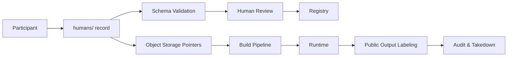

# Architecture

```mermaid
flowchart LR
  A[Participant] --> B[humans/ record]
  B --> C[Schema Validation]
  C --> D[Human Review]
  D --> E[Registry]
  B --> F[Object Storage Pointers]
  F --> G[Build Pipeline]
  G --> H[Runtime]
  H --> I[Public Output Labeling]
  I --> J[Audit & Takedown]
```
